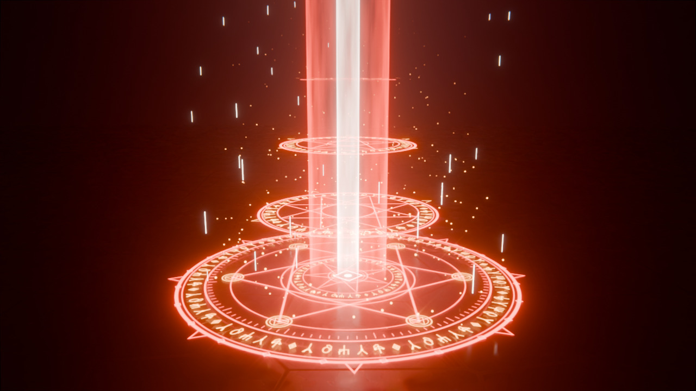
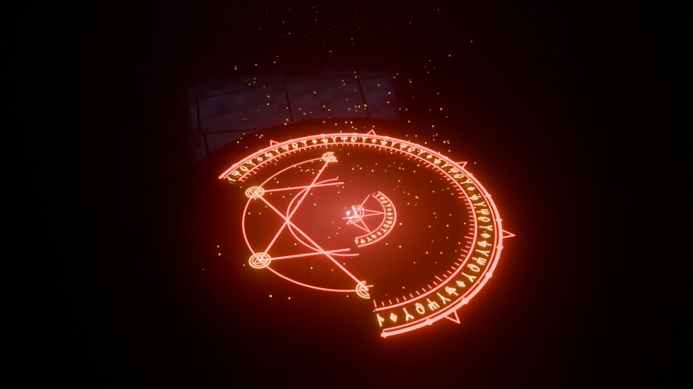
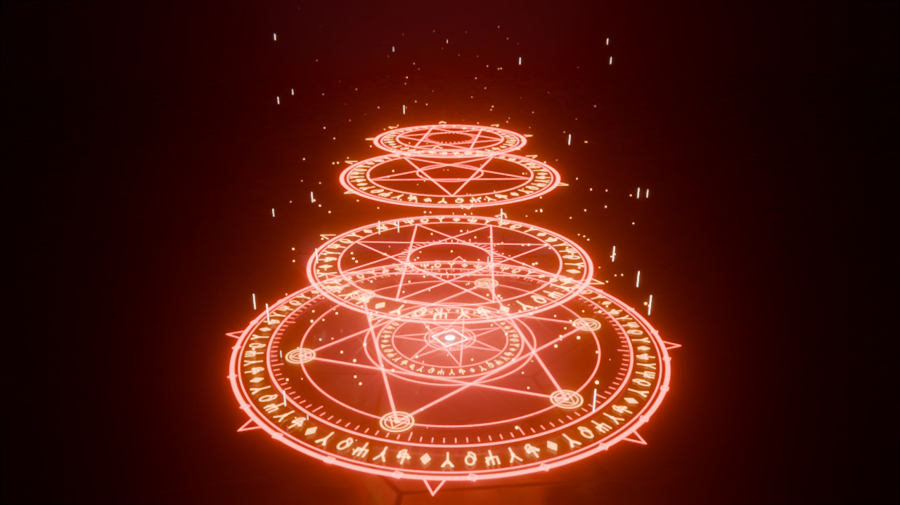
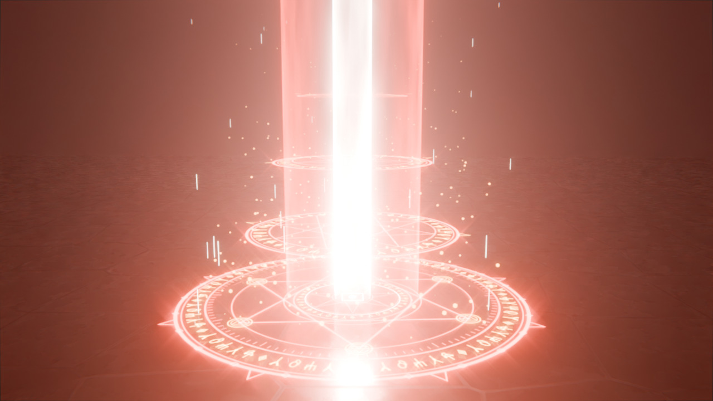
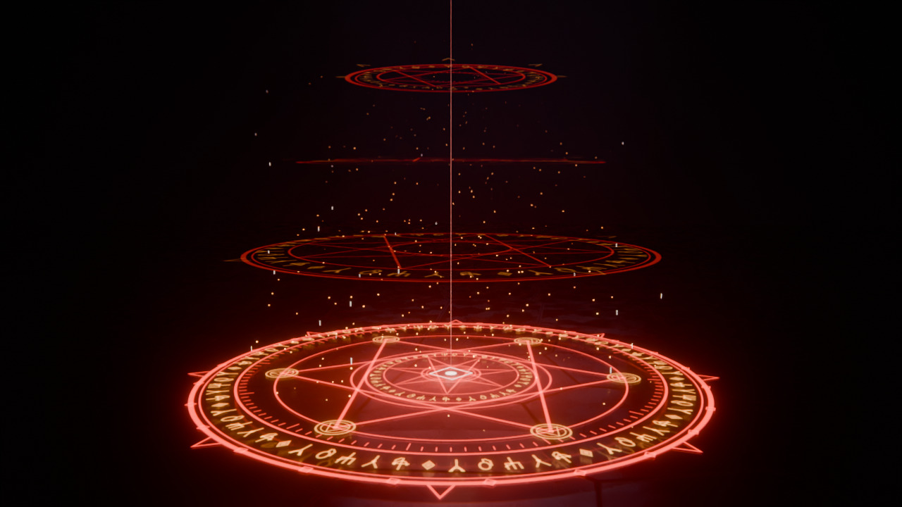

# GATOM : sortilège de téléportation (Blender)

Fan-art 3D inspiré de **The Misfit of Demon King Academy** (*Maou Gakuin no Futekigousha*).
Le sort de téléportation de la série s'appelle **Gatom** (転移). *Zekt*, lui, est le sort
de contrat. La scène représente donc Gatom, mais l'incantation écrite dans les runes se
change en une ligne (voir « Personnaliser »).



| Tracé du cercle | Cercles superposés | Flash | Dissipation |
|---|---|---|---|
|  |  |  |  |

Animation complète : [`apercus/gatom_animation.mp4`](apercus/gatom_animation.mp4)
(ou le GIF [`apercus/gatom_animation.gif`](apercus/gatom_animation.gif)).

## Contenu

| Fichier | Rôle |
|---|---|
| `gatom_teleportation.blend` | La scène prête à ouvrir (Blender 4.5 LTS, s'ouvre aussi en 5.x) |
| `gatom_teleportation.py` | Le script qui génère toute la scène (aucun fichier externe) |
| `apercus/` | Images et animation rendues avec Cycles |

## Utilisation rapide

1. Ouvrez `gatom_teleportation.blend`.
2. Passez la vue 3D en ombrage **Rendu** (touche `Z` → *Rendered*) et regardez par la caméra (`Pavé num. 0`).
3. `Espace` pour jouer l'animation (144 images, 6 s à 24 i/s).
4. `F12` rend l'image courante, `Ctrl + F12` rend l'animation dans `//rendu/`.

Le fichier est réglé sur **EEVEE** (rapide sur carte graphique). Pour un rendu plus fin,
passez en **Cycles** (*Propriétés du rendu → Moteur*) et activez le GPU dans
*Préférences → Système*.

## Régénérer / modifier avec le script

Dans Blender : onglet **Scripting** → *Ouvrir* `gatom_teleportation.py` → ▶ *Run Script*.
Une scène « GATOM » neuve est créée (vos autres scènes ne sont pas touchées).

En ligne de commande :

```bash
# créer le .blend
blender -b -P gatom_teleportation.py -- --save gatom.blend
# une image (le flash est à l'image 88)
blender -b -P gatom_teleportation.py -- --engine CYCLES --render flash.png --frame 88
# toute l'animation, à 50 %
blender -b -P gatom_teleportation.py -- --anim rendu/ --percent 50
```

Options : `--palette anos|azur|abysse`, `--incantation TEXTE`, `--engine EEVEE|CYCLES`,
`--samples N`, `--percent P`, `--frames 1:144`, `--no-fog`.

## Personnaliser

En haut du script :

| Paramètre | Effet |
|---|---|
| `INCANTATION = "GATOM"` | Texte écrit en runes dans tous les anneaux (ex. `"ZEKT"`) |
| `SEED` | Change le dessin de l'alphabet runique |
| `PALETTE` | `anos` (rouge sang / or), `azur` (bleu), `abysse` (violet) |
| `FOG` | Brume volumétrique (plus beau, plus lent) |
| `F_TRACE`, `F_LIFT`, `F_CHARGE`, `F_FLASH`, `F_GONE` | Chronologie du sort |

## Anatomie du sort

**Cercle au sol** : 3 couches qui tournent en sens opposés.
1. *Anneau runique* : double cercle extérieur, 8 pointes, 24 losanges, bande de runes
   « GATOM · GATOM · … », graduations.
2. *Hexagramme* : étoile {6/2} et 6 cercles satellites (triangle + losange).
3. *Cœur* : 2e bande de runes, heptagramme {7/3} et sceau central.

**Cercles flottants** : 3 cercles (octagramme, pentagramme, double triangle) qui
s'élèvent depuis le sol et forment un couloir vertical.

**Effets** : colonne de lumière (gaine rouge + cœur blanc, stries qui montent),
particules de mana et traînées lumineuses (Geometry Nodes), halo au sol, onde de choc,
flash lumineux, secousse de caméra, bloom, étoile de lumière et aberration chromatique
au compositing.

### Chronologie

| Images | Temps | Événement |
|---|---|---|
| 1 → 30 | 0 → 1,2 s | Le cercle se trace au sol, couche par couche, en balayage |
| 24 → 62 | 1 → 2,6 s | Les trois cercles flottants s'élèvent en tournant |
| 60 → 86 | 2,5 → 3,6 s | La mana se concentre, la colonne de lumière jaillit |
| **88** | **3,7 s** | **Téléportation** : flash, onde de choc |
| 88 → 132 | 3,7 → 5,5 s | La colonne se resserre en un fil de lumière et les cercles se dissipent |

## Notes techniques

- Tous les traits sont des rubans plats générés avec `bmesh`. Leur matériau
  « Transparent + Émission » **additionne** la lumière, comme dans un anime.
- La luminosité de chaque élément vient de la propriété personnalisée animée `fade`
  de l'objet, lue dans le shader par un nœud *Attribute* (type *Object*).
- Le tracé progressif utilise un modificateur **Build**, avec les faces triées par
  angle pour obtenir un balayage.
- Les runes forment un **alphabet inventé**, généré de façon déterministe, et ne
  reproduisent aucun élément officiel de la série.
- Testé avec Blender 4.5 LTS (EEVEE et Cycles) et 5.0 (Cycles).
